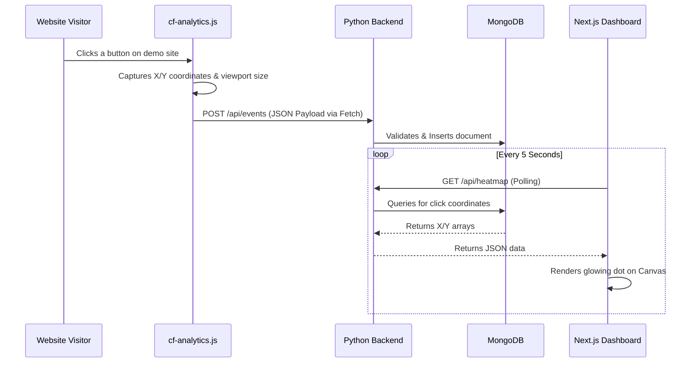

# User Analytics Platform: Architecture & Codebase Breakdown

This document provides a comprehensive, file-by-file explanation of the User Analytics platform. It explains what we built, how the different pieces connect, and how data flows from a user's click all the way to the analytics dashboard.

---

## 1. High-Level Architecture & Data Flow

The project is structured into **four main pieces** that run simultaneously using Docker:

1. **The Demo Site & Tracker (`tracker/`)**: A fake e-commerce website that serves our custom JavaScript tracking script.
2. **The Backend API (`backend/`)**: A Python/Flask server that receives events from the tracker and serves data to the dashboard.
3. **The Database (MongoDB)**: A NoSQL database that permanently stores every single event.
4. **The Dashboard (`dashboard/`)**: A Next.js web application where site owners can view KPIs, user sessions, and real-time heatmaps.

### The Data Flow (The Journey of a Click)

---

## 2. The Tracker (`tracker/`)

This directory acts as the "Client" in our system. It contains a static HTML website and our proprietary tracking script. Nginx serves this folder on `http://localhost:8080`.

### `cf-analytics.js` (The Engine)
This is the most critical file on the client side. It operates silently in the background of the website.
- **Session Management**: When the script loads, it checks the browser's `localStorage` for a `cf_session_id`. If one doesn't exist, it generates a random UUID (e.g., `user-1234`) and saves it. This allows us to track the same user as they navigate from the homepage to the cart.
- **Event Listeners**: It attaches hidden listeners to the `document` object.
  - `click`: Captures `e.clientX` and `e.clientY` (where the mouse was), plus the browser window size (`window.innerWidth/Height`).
  - `scroll`: Calculates how far down the page the user scrolled (25%, 50%, etc.).
  - `submit`: Detects when forms are submitted.
- **Data Transmission**: It takes this data, bundles it into a JSON object, and uses the standard `fetch()` API with `keepalive: true` to send a `POST` request to the backend. The `keepalive` flag ensures the event is sent even if the user immediately closes the tab.

### `*.html` & `styles.css`
These files (`index.html`, `products.html`, `cart.html`, etc.) make up a dummy e-commerce store. Their only real purpose is to provide a UI for us to click on. Every single HTML file has `` injected just before the closing `</body>` tag.

---

## 3. The Backend API (`backend/`)

The backend is built with **Python and Flask**. It acts as the traffic controller—ingesting raw data from the tracker and formatting it for the dashboard. It runs on `http://localhost:5000`.

### `app.py` (The Entry Point)
Initializes the Flask server, sets up CORS (Cross-Origin Resource Sharing) so the tracker is legally allowed to send data from a different domain (`8080` to `5000`), and registers our API routes.

### `db.py` (Database Connection)
Connects to MongoDB using `pymongo`. It also ensures database indexes are created (e.g., indexing `session_id` and `timestamp`) so that querying thousands of events remains lightning fast.

### `routes/events.py` (The Brains)
This file contains all the REST API endpoints:
- `POST /api/events`: Receives JSON from `cf-analytics.js`. It validates that required fields (like `session_id` and `timestamp`) exist, adds a server-side timestamp (`received_at`), and saves it to MongoDB.
- `GET /api/stats`: Calculates the high-level KPIs for the dashboard's Overview page (Total Views, Total Sessions, Top Pages).
- `GET /api/sessions`: Groups raw events into distinct "Sessions" to show how many unique users visited and how long they stayed.
- `GET /api/sessions/<id>`: Fetches the chronological timeline of events for a specific user.
- `GET /api/heatmap`: Fetches all the `x` and `y` coordinates for `click` events on a specific page URL.

### `requirements.txt` & `Dockerfile`
Standard Python packaging files. The Dockerfile instructs Docker on how to build an isolated Linux environment, install Python, install Flask/PyMongo, and run `gunicorn` (a production-grade web server) to serve `app.py`.

---

## 4. The Frontend Dashboard (`dashboard/`)

The dashboard is built using **Next.js 14** (React) using the modern App Router. It runs on `http://localhost:3000`. It is heavily styled using Tailwind CSS for a premium, dark-mode aesthetic.

### `app/layout.tsx` & `components/Sidebar.tsx`
`layout.tsx` is the master wrapper for the entire dashboard. It imports global CSS and renders the `Sidebar`. The Sidebar provides consistent navigation between the Overview, Sessions, and Heatmap pages.

### `app/page.tsx` (Overview / KPIs)
A Client Component that uses React's `useEffect` to poll the `GET /api/stats` endpoint every 5 seconds. It renders premium "metric cards" showing total page views, clicks, and a leaderboard of the most popular pages.

### `app/sessions/page.tsx` (User Journeys)
Polls the `GET /api/sessions` endpoint. It displays a data table of every unique visitor. Clicking on a row navigates to a detailed view for that specific session.

### `app/sessions/[id]/page.tsx` (Session Timeline)
Fetches data from `GET /api/sessions/<id>`. It maps over the array of events and renders a beautiful vertical timeline (like a Twitter feed) showing exactly what the user did, in order (e.g., *Viewed Homepage -> Scrolled 50% -> Clicked button -> Viewed Cart*).

### `app/heatmap/page.tsx` (The Heatmap Canvas)
The most complex UI file. 
1. It polls `GET /api/pages` to populate a dropdown menu with every page the tracker has seen.
2. Once a URL is selected, it polls `GET /api/heatmap`.
3. It renders a dark, wireframe mockup of a website using standard HTML `
`s.
4. It places an invisible HTML `<canvas>` element precisely over the top of the wireframe.
5. **The Math**: Because users might have different screen sizes, it takes the `click.x` and `click.y` coordinates and scales them mathematically to fit the dashboard's canvas size. 
6. **The Render**: It loops through the scaled coordinates and uses the HTML5 Canvas API to draw a dot with a radial gradient (fading from bright blue in the center to transparent on the edges). When multiple dots overlap, the canvas blends their opacities together to create "hot" glowing spots.

---

## 5. The Infrastructure

### `docker-compose.yml`
This is the master orchestrator. With a single command (`docker-compose up`), it boots up the entire ecosystem simultaneously:
1. **mongodb**: Pulls the official MongoDB image.
2. **backend**: Builds the Python image and passes it the `MONGODB_URI` so it knows how to talk to the database.
3. **frontend**: Builds the Next.js image.
4. **demo-site**: Pulls an Nginx web-server image and mounts our local `tracker/` directory into it, serving our fake store on port 8080.

It also creates an internal Docker network, allowing the backend to securely communicate with MongoDB without exposing the database to the public internet.
